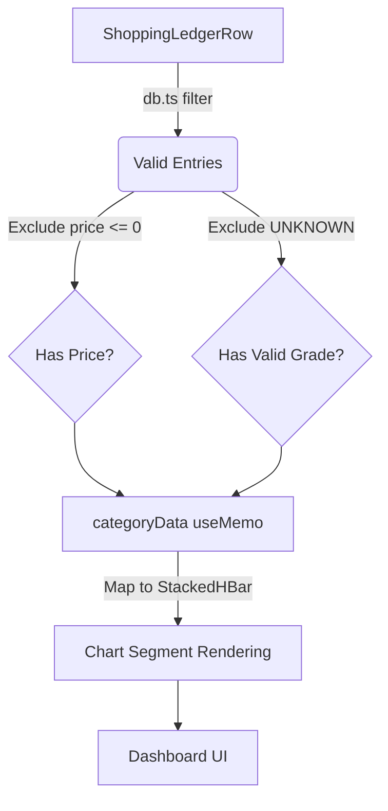
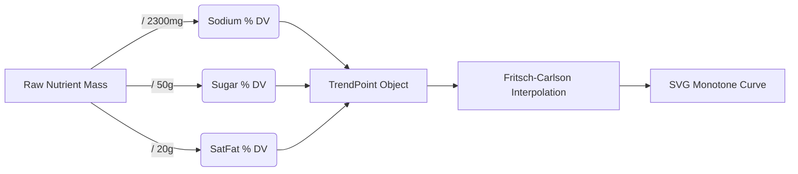

# NUT-04 — Nutri-Score Checkout Tool
## System Architecture & Technical Specification

> **Document Owner:** Kibet — Project Lead, NUT-04
> **Status:** In Review — Consolidated against evidence-linked requirements and personas
> **Standard:** C4 Model (Context → Containers → Components) & IEEE 1471
> **Related Docs:** [PRD](./01_PRD_NUT-04.md) · [API Reference](./03_API_Reference_NUT-04.md) · [Engineering Runbook](./04_Engineering_Runbook_NUT-04.md)

---

## Change Log

| Version | Date | Author | Summary of Changes |
|---|---|---|---|
| 0.1 | — | — | Initial skeleton created |
| 1.0 | 2026-08-08 | Claude (doc pass) | Populated from direct inspection of the shipped extension build |
| 1.1 | 2026-08-10 | Claude (consolidation pass) | Rewrote §6 Data Models around the flexible, layered database design defined in Requirements Spec v2.2 §10.5 (superseding the fixed 7-field DATA-001 schema); added ADR-005 documenting the offline-first architecture pivot away from FR-002's OFacts-primary design; cross-referenced NFR-006/SEC-002's CSS-custom-properties mandate against confirmed `innerHTML` usage; added NFR-004 toolchain conflict (Preact-mandated vs. shipped React) to the ADR index |

---

## 1. Document Control

| Field | Value |
|---|---|
| Version | 1.1 |
| Status | In Review |
| Author(s) | Kibet |
| Reviewers (Architecture Board) | JHUB Africa mentors |
| Approval Date | Pending |

---

## 2. Architectural Overview & Stakeholder Concerns (IEEE 1471)

### 2.1 Stakeholders & Concerns

| Stakeholder | Concern |
|---|---|
| Engineering | Maintainability of two parallel build toolchains; avoiding scoring-logic drift across `engine/score-engine.js` and `db.js`; reconciling NFR-004's Preact mandate with the shipped React stack; `build.cjs` still references a deleted `firebase-sync.js` entry point and will fail if invoked |
| Security | `innerHTML` usage contradicts NFR-006/SEC-002. Firebase/Firestore has since been fully removed from the shipped build — no SDK, no API key, no live sync — so the prior "live Firebase config ships in the public bundle" exposure no longer applies |
| Product | Time-to-market for the companion website; the Alternatives Engine (FR-013) is now functional end-to-end but its price-proximity filter depends on a live scan-time cache rather than the (still all-zero) static dataset price field |
| Data Governance | The flexible database design in Requirements Spec §10.5 is specified but only partially realised in the production datasets (see §6 below) |
| Operations | No CI, no automated tests, no telemetry — all verification is manual today |

### 2.2 Architectural Viewpoints
This document provides Context, Container, Component, Data, and Deployment views, scoped to the **current, fully client-side implementation**. There is no server-side container in this system today.

### 2.3 Architecture Decision Records (ADR) Index

| ADR ID | Title | Status | Notes |
|---|---|---|---|
| ADR-001 | Client-side-only architecture (no backend server) | Accepted | — |
| ADR-002 | IndexedDB (via bundled `idb`) for local persistence, not `chrome.storage` | Accepted | `manifest.json`'s `permissions` array is now empty — the unused `storage` permission flagged in earlier reviews has since been removed |
| ADR-003 | Shadow DOM for badge/flyout isolation from host-page CSS | Accepted | — |
| ADR-004 | Firebase/Firestore for optional cross-device ledger sync | **Reverted — removed from the codebase** | No `firebase-sync.js` source, no Firebase reference in `manifest.json`, `background.js`, or any content script. The only remnant is a dead entry-point reference in `build.cjs`, which will fail to build if invoked. The `externally_connectable` gap and undeployed Firestore rules are moot now that there is no sync code to reach |
| **ADR-005** | **Offline-first, dataset-primary product lookup — no live nutrition API call** | **Accepted (de facto), not yet formally ratified against FR-002** | Requirements Spec §9.1 FR-002 specifies an Open Food Facts API call with local fallback. The shipped `background.js` contains no live API call anywhere; every lookup resolves against the bundled canonical dataset via `NutriScoreDB.resolveProductMatch()`. Given EV-003 (OFacts returns no match for major Kenyan brands) and EV-SCI-012 (database coverage is the primary AINR quality bottleneck), this is a defensible pivot, but the requirements spec should be formally updated to reflect it rather than leaving FR-002 as a contradicted "Must" requirement. |
| **ADR-006** | **UI toolchain: React + Vite, not Preact** | **Unreconciled conflict** | NFR-004 states "Preact (not React) is mandated... No Tailwind CSS framework," citing a deliberate Phase-3 bundle-size decision. Direct inspection of the shipped `popup.html`/`dashboard.html` bundles confirms a Vite + React build. One of the two must change: either NFR-004 is amended, or the UI is migrated to Preact. Flagged for explicit resolution rather than silent continuation. |

---

## 3. C4 — Level 1: System Context Diagram

### 3.1 System Boundary
**Inside the boundary:** the Chrome Manifest V3 extension — background service worker, per-retailer content scripts, popup, options-page dashboard, and the local IndexedDB store.
**Outside the boundary:** the Naivas and Carrefour Kenya web front-ends, and the offline Python dataset-curation pipeline. **Not present as boundary members despite being named in the requirements spec:** Open Food Facts (see ADR-005) and Firebase/Firestore (see ADR-004 — fully removed, not merely external/optional).

### 3.2 External Actors & Systems

| Actor / System | Type | Interaction |
|---|---|---|
| Shopper (any of Personas 1–4, see PRD §3) | Person | Browses listings, views/clicks badges, adds items to cart, opens the dashboard |
| Data Curator | Person (internal) | Refreshes canonical datasets offline; owns the confidence-hierarchy and provenance backlog in §6 below |
| Naivas Online | External System | Magento 2 + Livewire storefront |
| Carrefour Kenya | External System | Next.js + SAP Commerce Cloud storefront |
| Open Food Facts | Referenced in requirements (FR-002) but **not an active dependency** of the shipped build — see ADR-005 | — |
| Firebase / Firestore | Referenced in requirements and in the original ADR-004 proposal, but **removed from the codebase** — no SDK, no sync module, no live dependency | — |

---

## 4. C4 — Level 2: Container Breakdown

| Container | Responsibility | Technology | Notes vs. Requirements Spec §10 Module Table |
|---|---|---|---|
| Background Service Worker (`background.js`) | Orchestrates FoodClassifier → ScoreEngine → DiseaseEngine → AlternativesEngine; message routing; IndexedDB init | Vanilla JS, MV3 service worker | Spec names this `background.ts` with an OFacts API call responsibility — see ADR-005 |
| Content Scripts (`content.js`) | `MutationObserver`-driven scan loop, cart-event capture, message relay | Vanilla JS | Spec names this `content-script.ts`; behavior matches FR-001 |
| Retailer Adapters (`adapters/naivas.js`, `adapters/carrefour.js`) | Shared adapter contract: `detectProducts`, `extractCartState`, `injectBadge`, etc. | Vanilla JS | Matches NFR-005's adapter-pattern requirement |
| Grade/Colour Constants (`adapters/grade-colors.js`) | Shared A–E grade → colour/label lookup table, loaded before `shared-ui.js` in both retailer content-script bundles | Vanilla JS | Not present in any prior revision of this document — confirmed via direct `manifest.json` inspection |
| Shared UI Renderer (`adapters/shared-ui.js`) | Shadow-DOM badge + flyout rendering | Vanilla JS | Spec's `widget.tsx` is described as Preact; see ADR-006. Uses `innerHTML`, contradicting NFR-006 |
| Core Engine Modules (`engine/*.js`) | Scoring/classification/disease/alternatives logic | Vanilla JS via `importScripts` | Spec names these `score-engine.ts`, `food-classifier.ts`, `disease-engine.ts`, `alternatives-engine.ts` — same responsibilities, different file extension (no TypeScript in the shipped build) |
| IndexedDB Data Layer (`db.js`) | Schema management (**v8**, adds a `price_cache` store over v7), CRUD, product matching, cart ledger, dashboard analytics | Vanilla JS wrapping bundled `idb` | See §6 for full data-governance reconciliation |
| Popup UI (`popup.html`) | Toolbar-icon quick view | Vite + **React** | Contradicts NFR-004's Preact mandate — ADR-006 |
| Dashboard UI (`dashboard.html`) | Full analytics dashboard | Vite + **React** | Same — ADR-006 |
| Static Datasets (`data/*.json`) | Canonical Naivas/Carrefour/KFCT nutrition data | Static JSON, ~9,274 combined records | See §6 |

---

## 5. C4 — Level 3: Component Breakdown

### 5.1 Background Service Worker — Components

| Component | Responsibility | Spec Requirement Mapping |
|---|---|---|
| `FoodClassifier` | SPF-exclusion gate; keyword/regex FSA category detection | FR-006, FR-007 |
| `ScoreEngine` | FSA-NPS 2023 N/P-points calculator, A–E grade | FR-003 (see PRD §4 for verified fidelity gaps: fibre scale, missing sweetener penalty) |
| `DiseaseEngine` | DR-001–DR-006 clinical threshold evaluation | FR-005, FR-009–FR-012 (see PRD §4 for the confirmed combined-warning divergence on FR-011/FR-012) |
| `AlternativesEngine` | Same-category, price-filtered ranking | FR-013, AI-001, AI-002 — **functional end-to-end.** `background.js` calls `NutriScoreDB.getAllProducts()` and passes the full same-retailer candidate list in; price-proximity filtering runs against the live `price_cache` rather than the static (all-zero) dataset price field — see §6.8 |
| `NutriScoreDB` facade | IndexedDB CRUD, product matching, cart ledger, analytics | Underlies DATA-001 through DATA-006, §10.5 |

### 5.2 Content Script / Adapter — Components
Unchanged from v1.0 of this document: `NutriScoreContentEngine`, `NaivasAdapter`/`CarrefourAdapter`, `NutriSharedUI`.

---

## 6. Data Models & Database Design (Reconciled with Requirements Spec §10.5)

### 6.0 Which requirement governs the schema?

Two requirements in the source spec describe the database, and they conflict: **DATA-001** (§9.5) specifies a fixed, "compressed" 7-field schema (`energy_kJ, sugars_100g, saturated_fat_100g, sodium_mg_100g, proteins_100g, fiber_100g, nova_group`) with the explicit instruction *"no additional fields stored."* **§10.5** (Data Governance and Database Lifecycle, added v2.2) specifies a flexible, layered model with a seven-tier confidence hierarchy, mandatory provenance fields, completeness thresholds, plausibility validation, and quality gates — structurally incompatible with a flat 7-field record.

**This document adopts §10.5 as authoritative.** Direct inspection of the shipped datasets confirms the actual schema already resembles §10.5's model far more than DATA-001's — it is a nested, multi-field, provenance-carrying record, not a flat 7-field one. DATA-001 as literally written was never implemented and should be retired in the next spec revision rather than left contradicting §10.5.

### 6.1 CanonicalGroceryProduct — actual shipped schema (verified against `naivas_final.json` / `carrefour_final.json`)

```
CanonicalGroceryProduct {
  Identity: {
    ProductID: string (UUID)          // IndexedDB keyPath
    GlobalProductID: string | null
    GTIN: string | null
    ProductName: string
    BrandName: string
    Retailer: "NAIVAS" | "CARREFOUR"
    RetailerProductUrl: string
    NormalizedName: string
  }
  Classification: {
    CanonicalFoodClass: string
    NutritionCategory: string
    FSACategoryCode: "GENERAL_FOOD" | "RED_MEAT" | "CHEESE" | "ADDED_FAT" | "BEVERAGE"
    // ⚠ No KNPM 25-category code field exists yet — EV-KE-001 requires this
    // to sit alongside FSACategoryCode; not present in the shipped schema.
  }
  Packaging: { PackSizeValue: number, PackSizeUnit: string }
  Nutrition: {
    Basis: "per_100g" | "per_100ml"
    EnergyKJ, EnergyKcal, SugarsG, SaturatedFatG, FatG,
    CarbohydratesG, FibreG, ProteinG, SodiumMG, SaltG: number
    FVL: { Percentage: number, Basis: string, Confidence: string }
    // ⚠ No PotassiumMG field — blocks DR-005 kidney rule regardless;
    // background.js reads a field that's always undefined here, so the
    // value resolves to null (not a hardcoded 0) — see §9.1/ADR reconciliation
  }
  NutritionProvenance: {
    // §10.5.3 requires 7 fields; only 5 exist here, and only EvidenceType
    // matches the prescribed name exactly — see §6.3 below
    ValueSpecificity: string
    EvidenceLevel: string             // ad hoc vocabulary — see §6.3
    EvidenceType: string | null
    SourceID: string | null
    SourceName: string | null
  }
  Validation: {
    ReviewState: string               // close to but not named ReviewStatus per §10.5.3
    ConsistencyChecks: { Atwater, SaltSodium, CategoryPlausibility: "passed" | "failed" | "not_checked" }
    DataQualityFlags: string[]        // see §6.5
  }
  Price: {
    CurrentPriceKES: number           // ⚠ 0 for 100% of both datasets — Code Review Issue #2
    OriginalPriceKES, DiscountAmountKES, DiscountPercentage: number
    Currency: "KES"
    InStock: boolean | null
    SKU: string
    ImageUrl: string
    ScrapedAt: ISO-8601 string
  }
  // ⚠ No IsEligibleForScoring / ExclusionReason fields — DATA-005's
  // negligible-nutrition exclusion is handled at runtime by FoodClassifier
  // instead of as a pre-computed dataset field. See §6.7.
}
```

### 6.2 The Layered Data Architecture (§10.5.1) — as actually implemented

| Layer | Spec Definition | Actual Build Status |
|---|---|---|
| 1. Governance (requirements spec) | Authoritative standard | This document + the requirements spec jointly serve this role |
| 2. KFCT 2018 (immutable reference) | Extended, never edited in place | Ships as `data/kfct2018_reference_validated.json`; `db.js` imports it from that exact lowercase path — the two match exactly, so it **imports and functions correctly** in the current build. No filename case mismatch exists |
| 3. Curated nutrition reference DB | KFCT + FAO/USDA/M&W + manufacturer labels | Partially realised via per-record `NutritionProvenance`, but no separate, queryable reference layer independent of the retailer records was found |
| 4. Retailer product databases | Consume the reference layer | ✅ `naivas_final.json` / `carrefour_final.json` |
| 5. FSA-NPS scoring engine | — | ✅ `engine/score-engine.js` |
| 6. Browser extension | — | ✅ Shipped |

### 6.3 Confidence Hierarchy (§10.5.2) — Prescribed vs. Actual

Prescribed 7 tiers (strongest → weakest): `manufacturer_verified`, `kfct_verified`, `international_fct_verified`, `kenyan_fallback`, `manufacturer_estimated`, `category_default`, `manual_review_required`.

**Actual `EvidenceLevel` values found by direct enumeration across both full datasets:**

| Dataset | Distinct values in use | No value at all |
|---|---|---|
| Naivas (n=3,518) | `category_reference` (570), `retailer_matched_product` (1,434), `unverified` (95), `single_ingredient_known_composition` (188), `international_fct` (20), `recovered_pending_evidence` (28), `manufacturer` (3), `rejected` (15), `retailer_matched_product_low_confidence` (2) | 1,163 (33%) |
| Carrefour (n=5,756) | `category_reference` (4,820), `unresolved` (894), `international_fct` (42) | 0 |

None of these ad hoc values match the prescribed vocabulary by exact name, and the two retailers don't share a consistent vocabulary with each other. The spec's claim that ad hoc values "have been mapped onto this hierarchy in the production datasets" is not yet true of the shipped build.

### 6.4 Mandatory Provenance Fields (§10.5.3) — Prescribed vs. Actual

Prescribed: `SourceDatabase`, `SourceFoodCode`, `EvidenceType`, `ValidationMethod`, `Reviewer`, `ValidationDate`, `ReviewStatus`. Actual (see §6.1): `ValueSpecificity`, `EvidenceLevel`, `EvidenceType`, `SourceID`, `SourceName` (under `NutritionProvenance`) plus `ReviewState` (under `Validation`, a separate object). Missing entirely: `SourceDatabase`, `SourceFoodCode` (though `SourceID`/`SourceName` may be intended as their informal equivalents), `ValidationMethod`, `Reviewer`, `ValidationDate`.

### 6.5 Completeness (§10.5.4) and Plausibility Validation (§10.5.5) — Prescribed vs. Actual

| Rule | Target | Actual |
|---|---|---|
| Core macronutrients non-null | 100% | Carrefour 100% ✅ · Naivas ~67% 🟡 (1,163–1,172 of 3,518 records null across `EnergyKJ`/`SugarsG`/`FatG`/`CarbohydratesG`/`SaltG`/`SodiumMG`/`FibreG`/`ProteinG`) |
| `SALT_SODIUM_MISMATCH` flag | Raised on mismatch | Implemented as `salt_sodium_failed` / `salt_sodium_not_checked` — different name, and additionally distinguishes "checked and failed" from "never checked," which the spec's binary flag doesn't |
| `ENERGY_ATWATER_MISMATCH` flag | Raised on mismatch | Implemented as `atwater_failed` / `atwater_not_checked` / `energy_recalculated_for_atwater_consistency` — same naming gap, same useful extra granularity |
| Category-plausibility rules (oil-has-carbs, fruit-high-sodium, etc.) | Raised per rule | `category_plausibility_failed` / `category_plausibility_not_checked` exist as a general flag; the specific per-rule flags (`OIL_HAS_CARBS`, `FRUIT_HIGH_SODIUM`, `SUGAR_HAS_PROTEIN`) were not found broken out individually in the sampled data |

### 6.6 Record Lifecycle & Versioning (§10.5.6)
Prescribed: `OriginalKFCTValue`/`CompletedValue`/`CompletionMethod` for KFCT-derived values, plus `Reviewer`/`ValidationDate`/`CategoryReviewStatus` for retail records. None of these specific field names were found in the sampled schema (§6.1); `ReviewState` exists but the finer-grained lifecycle fields do not.

### 6.7 DATA-005 / DATA-006 Exclusion & Implausibility Flagging
No `IsEligibleForScoring` or `ExclusionReason` field exists anywhere in the schema (confirmed by direct search across both datasets). The negligible-nutrition exclusion concept DATA-005 describes **is** implemented, but at a different architectural layer than specified: `engine/food-classifier.js` performs this check at request time against the product name/category, not as a pre-computed field baked into the dataset. Functionally similar outcome, structurally different mechanism — worth reconciling explicitly rather than treating as equivalent by default, since a runtime check and a pre-tagged field have different failure modes (e.g. a runtime check re-derives the exclusion on every lookup rather than trusting a stored, auditable decision).

### 6.8 Quality Gates Before Production Promotion (§10.5.7) — Prescribed vs. Actual

| Gate | Target | Actual |
|---|---|---|
| Required nutrient fields complete | 100% | Carrefour 100% ✅ · Naivas ~67% 🟡 |
| Category-default records | <5% | If `category_reference` ≈ `category_default`: Naivas 16.2%, **Carrefour 83.7%** — both fail, Carrefour severely |
| Provenance fields populated | 100% | Naivas 67% have any `EvidenceLevel`; Carrefour 100% have one (vocabulary caveats per §6.3 apply to both) |
| Manual review for high-risk categories (oils, cheese, dairy, soft drinks, cereals, confectionery, processed meat) | Required before promotion | Not independently verified per-category in this review |

### 6.9 Engine Result Shapes
Unchanged from v1.0: `ScoreResult`, `ClassifyResult`, `DiseaseResult`, `AlternativesResult`, `InterpretationResult` — see the API Reference document for the full field-level contract.

### 6.10 Object-Store Relationships
Updated from v1.0: IndexedDB `nut04-nutriscore` is now at schema **v8** (was v7). Stores: `carrefourProducts`, `naivasProducts`, `kfctReference`, `product_cache`, `shopping_ledger`, `dataset_metadata`, `user_settings`, and the new `price_cache` (added at v8) — a keyless store written by `NutriScoreDB.savePrice()` from live DOM-scraped prices and read back by `getAllProducts()` to give `AlternativesEngine` real price data despite the static dataset's `Price.CurrentPriceKES` field being `0` throughout. No formal ERD — object stores are independent and joined at query time.

---

## 7. Infrastructure & Deployment Blueprint
Unchanged from v1.0 of this document — see prior revision for environment topology, CI/CD pipeline overview, and the companion-website deployment-approach conflict.

---

## 8. Caching & Performance Strategy
Unchanged from v1.0 of this document.

---

## 9. Data Privacy & Compliance (GDPR / CCPA / Kenya DPA 2019)

### 9.1 Reconciled against DATA-002/003/004 and SEC-001–005

| Requirement | Statement (condensed) | Current Build Status |
|---|---|---|
| DATA-002 | Explicit consent modal before any shopping history is stored, stating local-only storage | ⬜ Not independently verified — depends on the compiled React dashboard's internal logic, outside this review's direct-source-inspection scope |
| DATA-003 | Single-click "Delete all my data," completing <1s | 🟡 `NutriScoreDB.purgeAll()` exists in `db.js` as the underlying mechanism; whether it is exposed as a single-click UI affordance in the shipped dashboard was not independently verified |
| DATA-004 | No PII/history/health-flag transmission to any external server; only product-name strings to OFacts | ✅ Consistent with the shipped build. Since ADR-005 means no OFacts calls happen at all, there is no product-name transmission; since ADR-004's Firebase sync has been fully removed (not merely unreachable), there is no ledger transmission either. No external network call of any kind exists in `background.js` today |
| SEC-001 | HTTPS/TLS 1.2+ only, `connect-src` restricted to `world.openfoodfacts.org` | ✅ No OFacts calls exist to restrict (ADR-005) and no Firestore calls exist either (ADR-004, removed) — the extension makes no outbound network requests at all in the current build, so there is no external origin left to audit |
| SEC-002 | No `eval()`, no `innerHTML`, CSS-custom-properties-only colours, strict CSP | ❌ **Contradicted** — `shared-ui.js` uses `innerHTML` (escaped) — see §4/§6, ADR discussion, and Code Review Issue references |
| SEC-003 | Health-condition toggles stored as local boolean flags only, never transmitted | ✅ Consistent with `user_settings` IndexedDB store design |
| SEC-004 | Privacy Policy published before Web Store submission | ❌ Not found in the reviewed build |
| SEC-005 | GPG-signed commits, signed release tags, branch protection | ⬜ Not verifiable from a source-code snapshot; requires repository/GitHub settings review |

---

## 10. Security Architecture
Updated from v1.0: the encryption/authentication sections describing Firebase Authentication and Firestore rules no longer apply — that integration has been fully removed (ADR-004). See §9.1 above for the SEC-00x reconciliation and §4/§6 for the NFR-006/SEC-002 `innerHTML` finding, which is now the single most concrete security-relevant gap identified against the requirements spec.

---

## 11. Traceability

| PRD Feature ID | Architecture Component | Verified Status |
|---|---|---|
| FR-001 | `NutriScoreContentEngine` | ✅ |
| FR-002 | — | 🟡 Diverged, see ADR-005 |
| FR-003 | `ScoreEngine` | 🟡 Partial, see §5.1/PRD §4 |
| FR-005/009/010 | `DiseaseEngine` | ✅ |
| FR-011/012 | `DiseaseEngine` | 🟡 Diverged (independent vs. combined warnings) |
| FR-013/AI-001/AI-002 | `AlternativesEngine` | ✅ Functional end-to-end (price-proximity depends on live `price_cache`, not the static dataset field) |
| DATA-001 | — | Superseded by §10.5 — see §6 |
| §10.5 (all subsections) | `db.js`, canonical datasets | 🟡 Partially realised — see §6.2–6.8 |

---

## 12. Dashboard Analytics & Visualization Pipeline (v1.2)

### 12.1 Category Insights Pipeline

The category insights chart processes ledger entries to show KES spend proportionally split by Nutri-Score grade.



**Key Data Logic:**
- **Null Exclusion**: Items without scraped prices are completely excluded from the KES spend totals, preventing chart distortion.
- **Grade Segmentation**: Categories map distinct grades (A–E) into segments on a continuous horizontal axis.
- **Item Context**: Bar labels present the category name and valid item count (e.g. "Dairy (12)") to distinguish volume vs. total spend.

### 12.2 Nutrient Trends Pipeline

Nutrient trends normalise absolute mass (mg/g) against FDA Daily Values to render a unified `% DV` timeline.



**Key Implementations:**
- **OR-Gate Accumulation**: Bucketing logic triggers if *any* nutrient data is present (`hasAny = sugar !== null || sodium !== null || satFat !== null`), avoiding missing buckets from partial records.
- **Monotone Interpolation**: Smooth cubic Hermite (Fritsch-Carlson) interpolation guarantees smooth curves that never mathematically overshoot the raw data values.
- **Gap Bridging**: Empty chronological buckets are rendered as flat interpolations to the next real data point, avoiding artificial plunges to 0% DV.

---

## Appendix
- **Glossary & ADR Archive:** See PRD Appendix.
