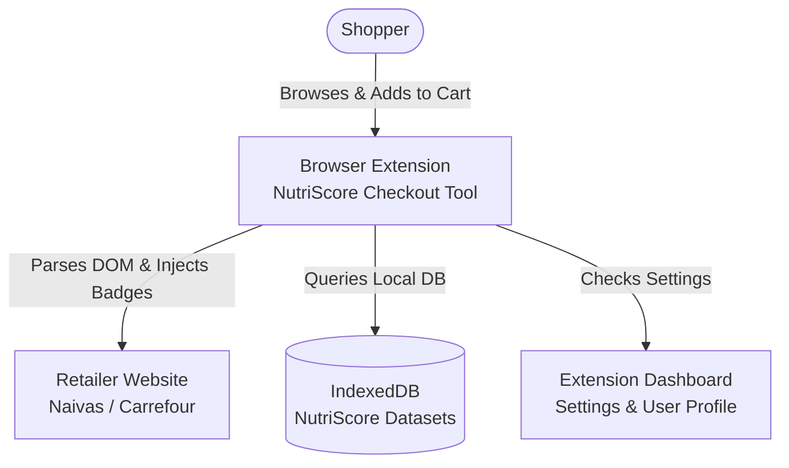
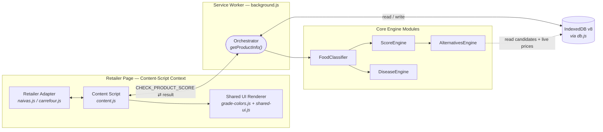
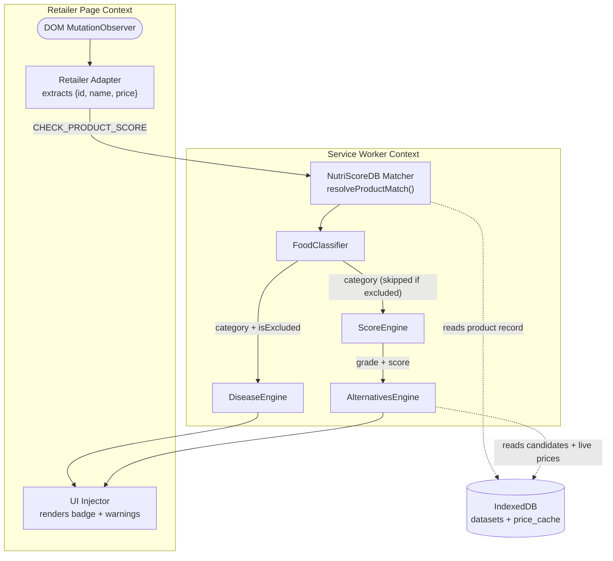
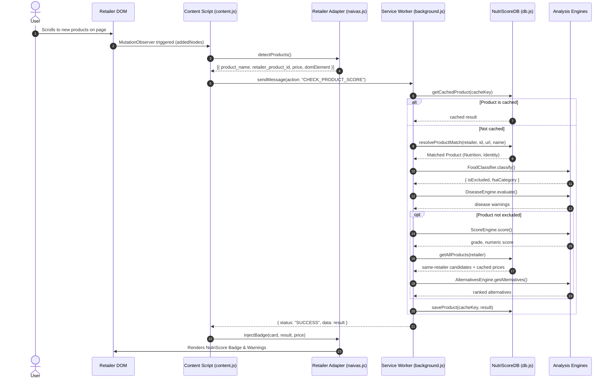

# Technical Design Document (TDD): NutriScore Checkout Tool (Kenya)

## 1. System Overview

**High-Level Summary:**
The NutriScore Checkout Tool (Kenya) is a browser extension that intercepts grocery items on retailer websites (such as Naivas and Carrefour) to provide real-time nutritional grading and disease-specific dietary warnings. It evaluates product health risks locally, calculates a NutriScore grade, and suggests healthier alternatives directly within the shopper's e-commerce interface.

**Tech Stack:**
*   **Languages:** JavaScript (vanilla, `importScripts`-based for the service worker/content scripts/engines/adapters), TypeScript (application code for the popup and dashboard — `db.ts`, `domain.ts`, `nutriscore.ts`, `products.ts`, `analytics.ts`, not just build config), HTML, CSS.
*   **Frameworks & Build Tools:** **React** (popup + dashboard) via Vite, TailwindCSS. The requirements spec's NFR-004 mandates Preact instead — this is a confirmed, unreconciled conflict (see System Architecture doc ADR-006), not a "React/Preact" either-or in practice. What ships today is React.
*   **Storage:** IndexedDB (via the `idb` library, wrapped in `db.js`/`db.ts`) for local dataset storage, the shopping ledger, and a live scan-time price cache.
*   **Architecture:** Chrome Extension Manifest V3 (Background Service Worker, per-retailer Content Scripts, Options Page, and Popup). No server-side component and no external network calls exist in the current build — see §2 and §3.

---

## 2. Architecture Diagrams (Mermaid)

### System Context Diagram

### Container Diagram

*Note: `FoodClassifier` gates the pipeline — if a product is SPF-excluded, `ScoreEngine` and `AlternativesEngine` are skipped entirely and a `LetterGrade: "UNKNOWN"` result is returned; only `DiseaseEngine` still runs. No Firebase/Firestore container exists in the current build — it was scaffolded early on and has since been fully removed (see System Architecture doc, ADR-004).*

---

## 3. Data Flow Analysis

**Lifecycle of a Product Entity:**
1.  **Input:** The `NutriScoreContentEngine` (via `MutationObserver` in `content.js`) detects a new product DOM element on the retailer page. It delegates to the `RetailerAdapter` to extract metadata like `product_name`, `url`, `retailer_product_id`, and `price`.
2.  **Transmission:** The Content Script sends a message payload to the Background Service Worker (`background.js`) to evaluate the product.
3.  **Lookup & Caching:** The Service Worker queries `NutriScoreDB` to check if the product is already cached. If not, it executes `resolveProductMatch` to find the corresponding dataset entry locally.
4.  **Processing (Orchestration):** 
    *   `FoodClassifier.classify()` categorizes the item (e.g., Beverage vs. General Food).
    *   `DiseaseEngine.evaluate()` assesses the nutritional data against active disease warnings (Diabetes, Hypertension, etc.).
    *   `ScoreEngine.score()` calculates the final FSA-NPS numeric score and letter grade.
    *   `AlternativesEngine.getAlternatives()` finds healthier substitutes within the same category. It runs whenever the product isn't SPF-excluded — not only when the grade is poor — filtering candidates to a strictly better letter grade (or an equal A) and a price within ±30% (widened to ±50% if fewer than 3 results), using a live scan-time price cache rather than the static dataset's price field.
5.  **Output & UI Injection:** The enriched product object is cached and returned to the Content Script, which utilizes the adapter and `shared-ui.js` to render the interactive badge (Grade and Disease Warnings) back into the DOM.

### Level 1 Data Flow Diagram (DFD)

**Correction from the prior revision of this diagram:** `DiseaseEngine` and `ScoreEngine` are independent, parallel branches off `FoodClassifier`'s output — `DiseaseEngine` does **not** feed into `ScoreEngine`, and disease warnings play no role in the score calculation. `AlternativesEngine` also performs its own read from `IndexedDB` (a full same-retailer product list plus cached live prices), which the prior diagram omitted entirely.

---

## 4. Component Deep Dive

### Background Service Worker (`background.js`)
*   **Responsibility:** Acts as the central orchestrator (Component Architecture v2.0). It handles all heavy lifting, enforces business logic, coordinates the various analysis engines, and manages communication with the databases and content scripts.
*   **Key Functions:**
    1.  `initializeDatabases()`: Bootstraps the IndexedDB environment via `NutriScoreDB` and imports static datasets if they are not already populated.
    2.  `getProductInfo(payload, retailerCode)`: The primary orchestration function. It takes raw product payloads, fetches matched records from the DB, routes them through the classifiers and engines, and returns the final computed score and alternatives.
    3.  `Message Listeners`: Listens for `chrome.runtime.onMessage` events, routing on `message.action`: `CHECK_PRODUCT_SCORE` (score a product), `LOG_CART_ADD`, `SYNC_CART_STATE`, `REMOVE_CART_ITEM`, `CART_CLEARED`, and `ORDER_PLACED` (cart/ledger lifecycle events from the frontend).

### NutriScore Content Engine (`content.js`)
*   **Responsibility:** The client-facing extension layer. It observes DOM mutations (debounced by 300ms to maintain performance), extracts product data using retailer-specific adapters, relays requests to the background worker, and handles UI interactions (flyouts, cart clicks) without containing any core business logic.
*   **Key Functions:**
    1.  `init()`: Sets up document-level click listeners for cart interactions, handles flyout UI state, and prepares the MutationObserver.
    2.  `scanAndInject()`: Triggered by the MutationObserver. It scans the DOM for unprocessed product cards and delegates to the adapter for data extraction and eventual UI injection.
    3.  `syncCart()`: Monitors the user's shopping cart state and relays lifecycle events (`LOG_CART_ADD`, `REMOVE_CART_ITEM`, `CART_CLEARED`) to the background worker.

### Sequence Diagram: Product Evaluation

**Corrections from the prior revision:** the message action is `CHECK_PRODUCT_SCORE`, not `GET_PRODUCT_INFO` — no `GET_PRODUCT_INFO` action exists anywhere in the source. The adapter's real entry point is the bulk `detectProducts()` scan (content.js calls it once per mutation batch and iterates the results), not a per-node `extractProduct(node)` method. `ScoreEngine` and `AlternativesEngine` only run when the product is not SPF-excluded, and `AlternativesEngine` requires its own `getAllProducts()` round trip to `IndexedDB` — both omitted from the prior version of this diagram.
