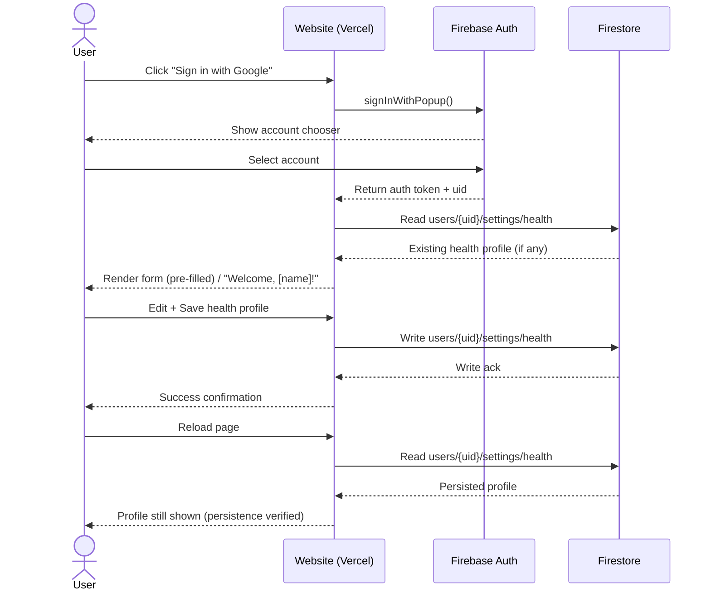
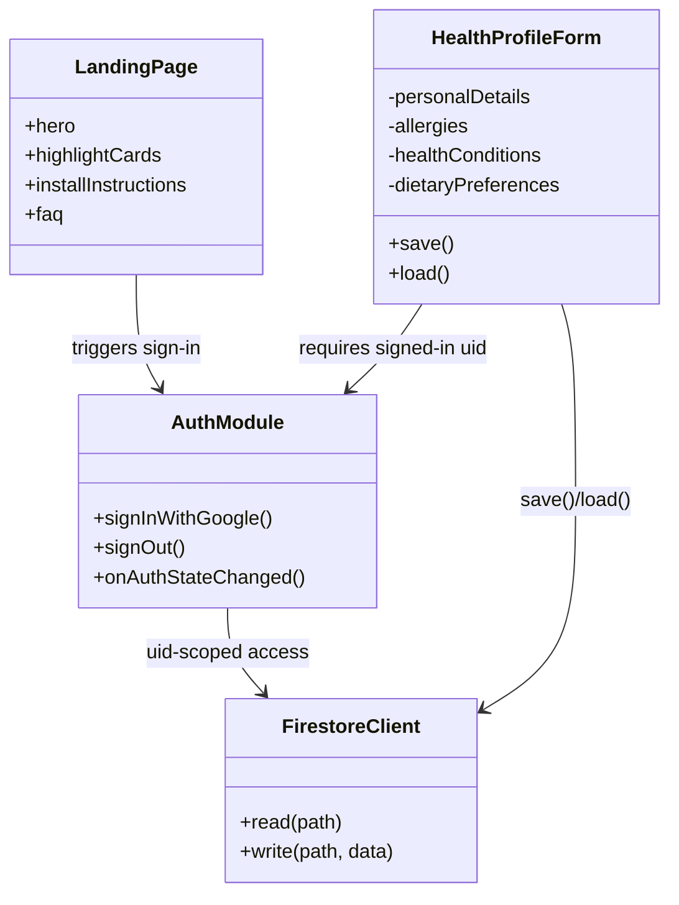

# NutriScore — Website (Marketing / Account Foundation)

## Purpose

The marketing/account website is the public-facing entry point to NutriScore: it explains the product, handles user identity, and owns the canonical copy of each user's health profile that the extension personalizes scoring against.

## Core functions

- **Marketing/landing experience:** hero section, value proposition ("More than a score — smarter shopping, instantly"), highlight cards (Quick Scoring, Full Nutrient Data), install instructions, supported stores list, FAQ.
- **Account sign-in:** Google sign-in via Firebase Authentication; always shows the account chooser (fixed a bug where it used to auto-sign-in on repeat visits) so multiple users on a shared Chrome profile can pick their own account; shows a sign-up prompt for new accounts.
- **Health profile management:** structured form for age, gender, weight, height, allergies, health conditions (Diabetes, Hypertension, Heart disease, Gluten sensitivity, Lactose intolerance, Nut allergy, Low-sodium diet), and dietary preferences (Vegan, Vegetarian, Pescatarian, Low-carb, Low-fat, Keto, Gluten-free, Dairy-free, Paleo).
- **Persistence:** profile data is saved to Firestore at `users/{uid}/settings/health`, protected by per-user security rules — migrated off `localStorage`. Verified end-to-end: sign in → save → reload → preferences persist.
- **Status messaging:** health page subtitle switches between a sign-in prompt and "Welcome, [name]!" once signed in.

## Tech / infra

- Firebase project: `nutriscore-check`.
- Deployed on Vercel.
- Repo: `github.com/JHUB-AFRICA/nutriscore-check`, working mainly on branch `feature/sync-oauth-state`.
- Bugs resolved during the sign-in build: stale function conflicts left from Copilot, an invalid Firebase API key, a missing Firestore database, and a session-persistence issue with `onAuthStateChanged`.

## UML — sign-in & health profile save sequence

## UML — website module structure

