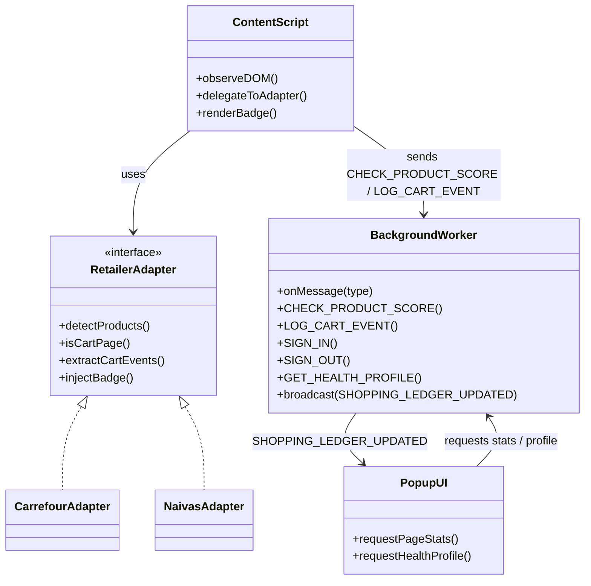
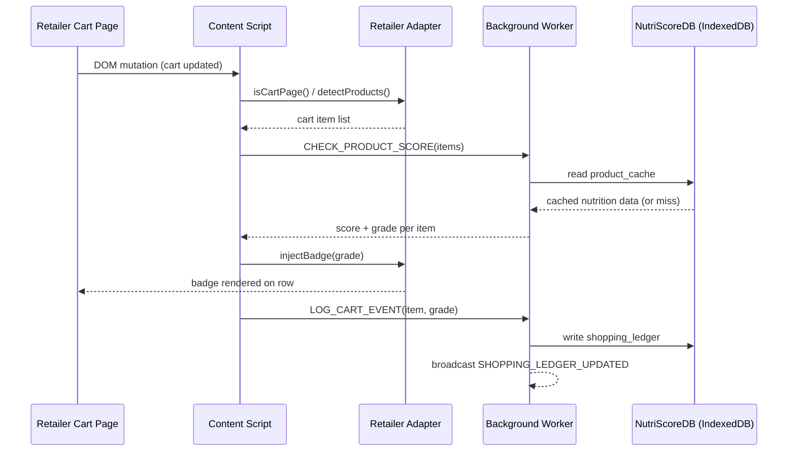

# NutriScore — Chrome Extension (Manifest V3)

## Purpose

The extension is the in-store layer: it runs on supported Kenyan grocery sites, watches the user's cart (not the whole page), scores items, and surfaces results as a badge, popup, and dashboard.

## Core functions

- **Content script (`content.js`):** runs in the retailer page context; watches the page via a DOM scan / MutationObserver loop (needed because retailer sites render dynamically via JS); delegates site-specific detection to a retailer adapter.
- **Retailer adapter:** site-specific layer (Naivas/Carrefour) that detects products on the page, detects whether the current view is a cart page, extracts cart actions/events, and injects the score badge. Carrefour's cart container is `#entries-SLOTTED` (confirmed); Naivas's is still pending.
- **Scoping rule:** scanning and badging only run on items actually in the cart — not every product on the page (e.g. a "Best Sellers" carousel is correctly ignored).
- **Badge:** small grade badge (`.badge-a` through `.badge-e`), 32px rounded to match the popup's icon-button styling, anchored to the actual product row at the same spot as the existing colored status dot.
- **Background service worker (`background.js`):** the message hub — routes `CHECK_PRODUCT_SCORE`, `LOG_CART_EVENT`, `SIGN_IN`/`SIGN_OUT`, `GET_HEALTH_PROFILE`, and broadcasts `SHOPPING_LEDGER_UPDATED` so open tabs can react to new data.
- **Popup UI (`popup.html`):** shows store-support status, items scored on the current page, signed-in account, and a link into the dashboard.

## Tech / build notes

- Manifest V3.
- **Important:** the build actually loaded in Chrome is unpacked from `dist/`, not `extension/` — `dist/` is ahead (has OAuth + Carrefour support `extension/` lacks). All extension changes need to target `dist/`.
- Manifest V3's default CSP blocks inline scripts, which currently blocks automatic dashboard tab refresh on new ledger events; fix identified, not yet finalized/verified.
- Docker image for the dev environment: `docker pull robinwanyoa7/nutriscore-check:latest`.

## Open blockers

- Naivas cart selector not yet confirmed.
- Dashboard auto-reload blocked by MV3 CSP.

## UML — extension component structure

## UML — cart scan sequence

