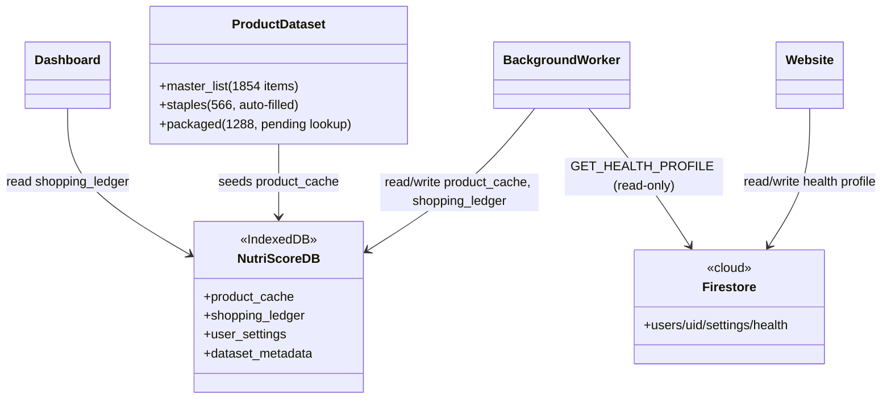
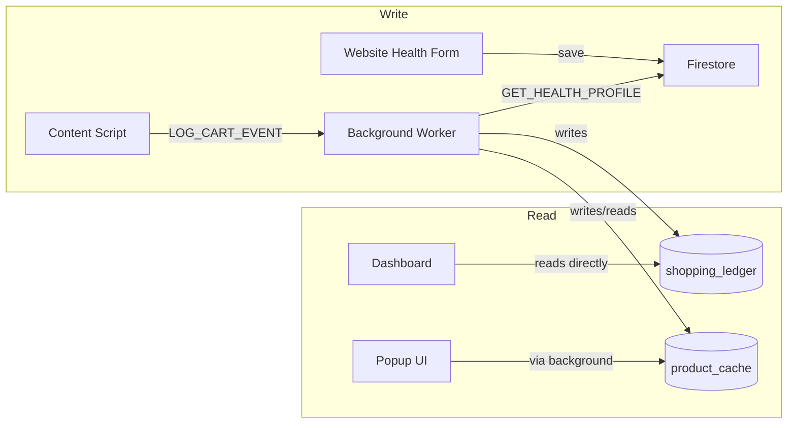

# NutriScore — Database & Data Layer

## Purpose

Two separate data layers cover two separate needs: a **local, on-device store** for fast scanning/scoring and private analytics, and a **cloud store** for account identity and health profile sync across devices.

## Core functions

### Local — NutriScoreDB (IndexedDB, inside the extension)

- `product_cache` — cached nutrition data per product, so repeat scans don't need to recompute/refetch.
- `shopping_ledger` — the historical log of confirmed cart events (name, category, grade, nutrient fields per event); this is what the dashboard reads directly.
- `user_settings` — local copy of user preferences used by the extension at scan time.
- `dataset_metadata` — bookkeeping for the product dataset (versioning, last-updated, coverage).
- Fully on-device: not synced anywhere; the dashboard shows a "Delete all my data" control and an events-stored count.

### Cloud — Firestore (via the website)

- `users/{uid}/settings/health` — the canonical health profile (conditions, dietary preferences, allergies, age/gender/weight/height), protected by per-user security rules. Written by the website's health profile form; read by the extension (`GET_HEALTH_PROFILE`) to personalize scoring.
- Firebase project: `nutriscore-check`.

### Source product dataset (Kenya)

- Master list: 1,854 Carrefour products (42 broken names repaired).
- Sorted into 566 staple items — auto-filled with standard regional nutrition facts, ready for health-score testing — and 1,288 packaged items, held pending branded-label lookup.
- Open Food Facts has limited Kenya coverage, so this locally-cleaned dataset supplements it; a further supplementary verified local database is still identified as a need.

## UML — data layer structure

## UML — where each store is written vs. read

