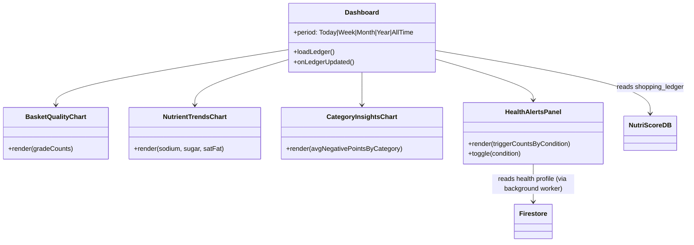
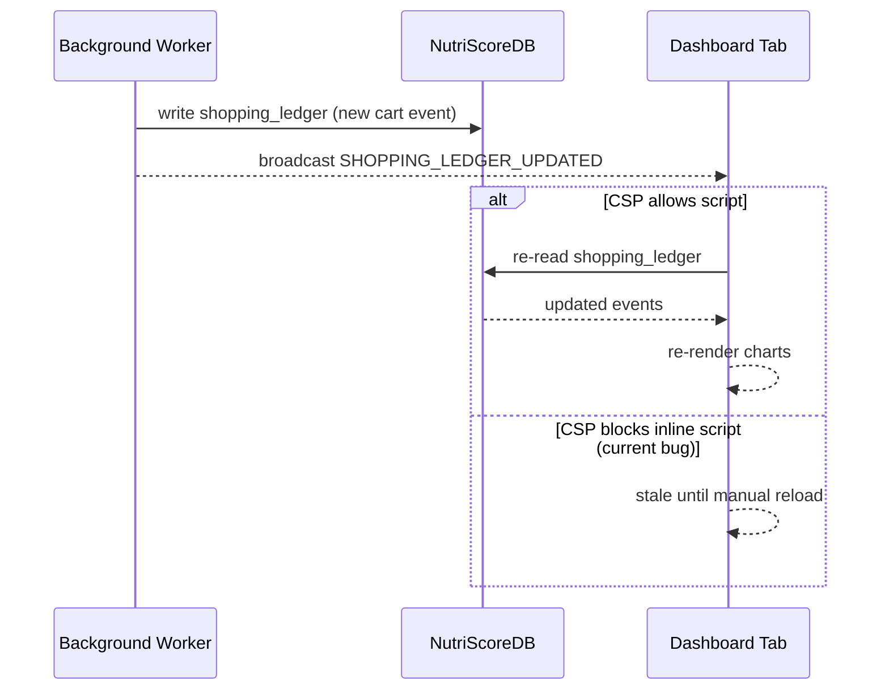

# NutriScore — Dashboard

## Purpose

The dashboard is the "so what" layer — it turns individual scanned items into a cumulative picture of a user's shopping health over time, and personalizes flags against their saved health profile.

## Core functions

- **Data source:** reads the `shopping_ledger` store in `NutriScoreDB` directly (not through the background worker), and re-renders when it receives a `SHOPPING_LEDGER_UPDATED` broadcast — auto-refresh is currently blocked by Manifest V3's CSP restriction on inline scripts (fix identified, not yet finalized/verified), so a manual reload is sometimes still needed.
- **Basket Quality** — donut chart of scanned items by grade (A–E), with a total-item count at the center.
- **Nutrient Trends** — line chart of average sodium (mg), sugar (g), and saturated fat (g) across scanned items, filterable by Today / This Week / This Month / This Year / All Time.
- **Category Insights** — bar chart of average negative points per food category (higher = worse), e.g. Red Meat vs. General Food.
- **Health Alerts & Controls** — per-condition toggles with counts of how many scanned items triggered each flag, driven by the health profile fetched from Firestore.
- **Privacy control:** "Delete all my data" clears the local ledger; an events-stored count is shown in the header.
- Built as a compiled React/Vite bundle (`dashboard.html` + JS bundle), confirmed working end-to-end on Carrefour test data.

## UML — dashboard component structure

## UML — dashboard refresh sequence

