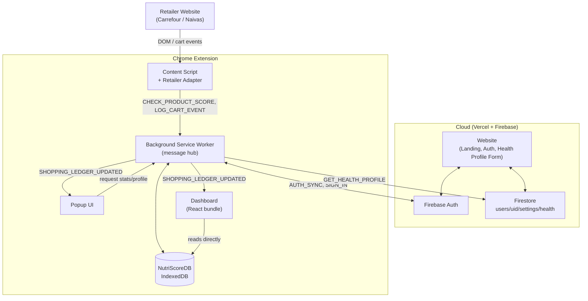
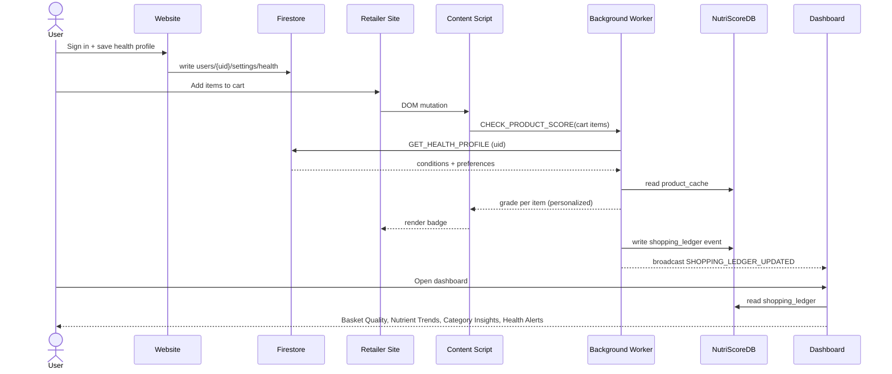

# NutriScore — How the Foundations Connect

## Purpose

This ties [[Website]], [[Extension]], [[Database]], and [[Dashboard]] together into one system view: where the boundary between "cloud/account" and "local/on-device" sits, and how a single cart scan turns into a dashboard update.

## In short

- The **website** owns identity (Firebase Auth) and the canonical **health profile** (Firestore).
- The **extension** owns everything that happens in-browser while shopping: detecting cart items, scoring them, and logging events.
- The **database layer** splits in two: Firestore (cloud, health profile only) and NutriScoreDB/IndexedDB (local, product cache + shopping ledger + settings).
- The **dashboard** is a read-heavy consumer: it reads the local ledger directly and reads the health profile (via the background worker) to personalize its alerts.

## UML — full system component diagram

## UML — end-to-end sequence: shop → score → analyze

## Boundary summary

| Layer | Owns | Storage | Synced? |
|---|---|---|---|
| Website | Identity, health profile UI | Firestore | Yes (cloud) |
| Extension (content + background) | Cart detection, scoring, message routing | — (in-memory + writes to NutriScoreDB) | No |
| Database | Health profile (Firestore) / product cache + ledger + settings (IndexedDB) | Split cloud/local | Health profile only |
| Dashboard | Analytics presentation | Reads NutriScoreDB directly | No — local only, user-deletable |
